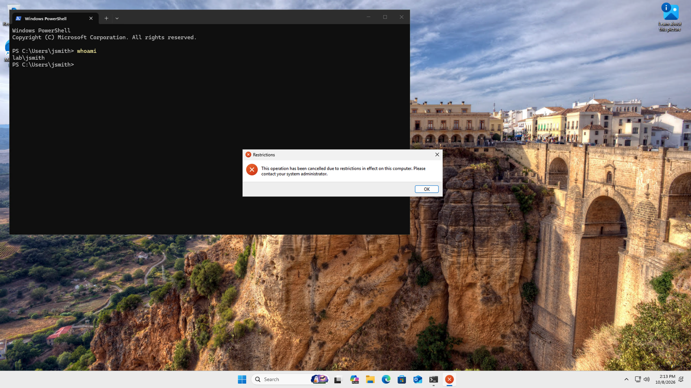

# Active Directory Lab in Microsoft Azure

A hands-on home lab where I built a small company network in the cloud: a Windows Server 2022 domain controller, a Windows 11 client joined to the domain, department OUs, role-based security groups, Group Policy, and common help desk tasks like account lockouts, password resets, and offboarding.

**Tools:** Microsoft Azure, Windows Server 2022, Active Directory Domain Services, DNS, Group Policy, PowerShell, Windows 11, Remote Desktop (Windows App on macOS)

---

## Lab Architecture

| Component | Details |
|---|---|
| Domain | `lab.local` (NetBIOS: `LAB`) |
| Domain controller | **DC01**: Windows Server 2022 Datacenter Azure Edition, Standard_B2als_v2, static private IP `10.0.0.4`, AD DS + DNS |
| Client | **CLIENT01**: Windows 11 Pro 25H2, Standard_B2als_v2, private IP `10.0.0.5`, joined to `lab.local` |
| Network | Azure virtual network `10.0.0.0/16`, subnet `10.0.0.0/24`, custom DNS server set to DC01 (`10.0.0.4`) |
| Region | North Central US |
| Security | RDP allowed only from my public IP (network security group rule), auto-shutdown at 11 PM, $25 budget with email alerts at 50/80/100% |

```
                 Azure Virtual Network 10.0.0.0/16  (DNS: 10.0.0.4)
   ┌──────────────────────────────────────────────────────────────┐
   │                                                              │
   │   DC01 (10.0.0.4)                    CLIENT01 (10.0.0.5)     │
   │   Windows Server 2022                Windows 11 Pro          │
   │   AD DS + DNS  ◄──── domain join ────  member of lab.local   │
   │                                                              │
   └──────────────────────────────▲───────────────────────────────┘
                                  │ RDP (3389), my IP only
                             My Mac (Windows App)
```

### Active Directory Structure

```
lab.local
├── IT                → Ty Vinyard (tvinyard), Alex Lee (alee, created with PowerShell)
├── HR                → Jane Doe (jdoe)
├── Sales             → John Smith (jsmith), Maria Garcia (mgarcia)
│   └── GPO linked: "Sales - Block Control Panel"
├── Workstations      → CLIENT01
└── Security Groups   → IT-Admins, HR-Staff, Sales-Staff
```

---

## What I Built (Step by Step)

### 1. Azure setup and cost controls
- Created a $25 budget with email alerts at 50%, 80%, and 100%.
- Created the resource group `rg-adlab`.
- Enabled auto-shutdown on every VM and stopped VMs after each session.

### 2. Domain controller (DC01)
- Deployed a Windows Server 2022 VM and restricted the RDP rule to my public IP only.
- Set DC01's private IP from dynamic to **static (10.0.0.4)**, because every computer in the domain depends on it for DNS.
- Installed the **Active Directory Domain Services** role and promoted DC01 to a domain controller for a new forest, **lab.local**, with integrated DNS.
- Pointed the virtual network's DNS setting to `10.0.0.4` so new VMs automatically use DC01 for DNS.

### 3. Organizational structure
- Created OUs for **IT, HR, Sales, Workstations,** and **Security Groups**.
- Created users in their department OUs.
- Created **role-based security groups** (IT-Admins, HR-Staff, Sales-Staff) and added members, so access can be granted to a group instead of to individual users.

### 4. Automation with PowerShell
Created a user and added them to a group from the command line:
```powershell
New-ADUser -Name "Alex Lee" -GivenName "Alex" -Surname "Lee" -SamAccountName "alee" `
  -UserPrincipalName "alee@lab.local" -Path "OU=IT,DC=lab,DC=local" `
  -AccountPassword (Read-Host -AsSecureString "Enter password") -Enabled $true
Add-ADGroupMember -Identity "IT-Admins" -Members "alee"
Get-ADUser alee | Select-Object Name, Enabled, DistinguishedName
```

### 5. Group Policy
| GPO | Linked to | Setting | Purpose |
|---|---|---|---|
| Default Domain Policy | `lab.local` | Account lockout threshold: 5 invalid attempts (15-minute lockout) | Slows down password-guessing attacks. Password and lockout policies only work at the domain level. |
| Sales - Block Control Panel | Sales OU | Prohibit access to Control Panel and PC settings | Shows how one department can be restricted without affecting others |

### 6. Windows 11 client and domain join
- Deployed CLIENT01 on the same virtual network.
- Verified DNS **before** joining (`ipconfig /all` showed DNS server `10.0.0.4`, and `nslookup lab.local` returned `10.0.0.4`).
- Joined the domain with PowerShell and restarted:
```powershell
Add-Computer -DomainName lab.local -Credential LAB\labadmin -Restart
```
- Confirmed the join (`whoami` → `lab\labadmin`, and the domain query returned `lab.local`).
- Moved CLIENT01 from the default Computers container into the **Workstations** OU, since Group Policy can't be linked to the default containers.
- Added `LAB\Domain Users` to CLIENT01's local Remote Desktop Users group so domain users could sign in remotely for testing.

### 7. Testing Group Policy
- Signed in to CLIENT01 as **lab\labadmin** (not in Sales): Control Panel opened normally.
- Signed in as **lab\jsmith** (Sales): Control Panel was blocked with *"This operation has been cancelled due to restrictions in effect on this computer."*
- This confirmed the policy applies **only** to users in the Sales OU.

### 8. Help desk drills
| Ticket | What I did |
|---|---|
| **Locked-out user** | Entered a wrong password 5 times as jsmith until the account locked (error 0xd07). On DC01, found the account with `Search-ADAccount -LockedOut`, unlocked it with `Unlock-ADAccount -Identity jsmith`, and confirmed no accounts were still locked. |
| **Forgotten password** | Reset Jane Doe's password in ADUC and required her to change it at next logon, so the help desk never knows the user's real password. |
| **Employee offboarding** | Disabled Maria Garcia's account instead of deleting it, which keeps her files and history available and lets IT re-enable her if needed. Verified with `Get-ADUser mgarcia \| Select-Object Name, Enabled` → `False`. |

---

## Troubleshooting Log

### 1. Azure deployment blocked by policy
- **Error:** "Deployment validation failed... The template deployment failed because of policy violation."
- **Cause:** My Azure for Students subscription has an **Allowed resource deployment regions** policy, and East US wasn't allowed.
- **Fix:** Found the policy under **Policy → Assignments**, read its allowed-locations parameter, and redeployed in **North Central US**.
- **Lesson:** Organizations use Azure Policy to control where resources can be created. When a deployment fails, read the error and check what policies apply.

### 2. VM size unavailable
- **Error:** Standard_B2s showed as "Size not available" in North Central US.
- **Cause:** Capacity and subscription restrictions on certain sizes in that region.
- **Fix:** Chose **Standard_B2als_v2** (2 vCPUs, 4 GB RAM), which was available and cheaper (~$0.05/hour).
- **Lesson:** Cloud resources aren't unlimited. Have a backup option and compare cost.

### 3. Default network used the wrong address range
- **Problem:** The VM wizard created a new network with `172.16.0.0/24`, not the planned `10.0.0.0/16`.
- **Fix:** Edited the network and subnet in the wizard to `10.0.0.0/16` and `10.0.0.0/24` so the DC would get `10.0.0.4`.
- **Lesson:** Check the networking defaults instead of accepting them.

### 4. PowerShell created a user named "-NameAlex Lee"
- **Cause:** I typed `-Name"Alex Lee"` with no space, so PowerShell didn't recognize `-Name` as a parameter and made it part of the value.
- **Fix:** Renamed the object instead of deleting it, which kept its group membership:
```powershell
Get-ADUser alee | Rename-ADObject -NewName "Alex Lee"
Set-ADUser alee -DisplayName "Alex Lee"
```
- **Lesson:** Always verify a command's output, and fix mistakes in place when possible.

### 5. More PowerShell spacing errors
- `(Get-WmiObject Win32_ComputerSystem) .Domain` → "Unexpected token '.Domain'." The dot has to touch the closing parenthesis.
- `Unlock-ADAccount -Identityjsmith` → "A parameter cannot be found that matches parameter name 'Identityjsmith'." There must be a space between the parameter and its value.
- **Lesson:** PowerShell parameters always follow the pattern `-Parameter value`. Reading the error message points straight to the problem.

### 6. Group Policy "didn't work" at first
- **Problem:** Control Panel still opened on CLIENT01.
- **Cause:** `whoami` showed I was signed in as **lab\labadmin**, who isn't in the Sales OU, so the policy correctly didn't apply.
- **Fix:** Signed in as **lab\jsmith**, and Control Panel was blocked as expected.
- **Lesson:** Confirm *who* you're testing as before assuming a policy is broken. `whoami` and `gpresult /r` are the first tools to use.

---

## How I Learned

I built this lab with help from Claude, an AI assistant, which guided me step by step and helped me read error messages. I did every step myself, from deploying the VMs to troubleshooting, and I made sure I understood why each step mattered. Using AI to learn new systems and troubleshoot faster, while checking its output against real results, is a skill I plan to keep using.

---

## What I Learned

*(Write this section in your own words. Some ideas:)*
- *How a domain controller, DNS, and client computers depend on each other, and why DNS has to be right before a domain join*
- *Why OUs exist and why Group Policy is linked to OUs instead of the default containers*
- *How role-based security groups make access management easier and safer*
- *Common help desk tasks (unlocks, resets, offboarding) and why we disable accounts instead of deleting them*
- *How to work within cloud restrictions such as policies, capacity, and cost*

---

## Screenshots

| # | Screenshot | File |
|---|---|---|
| 1 | Azure Policy "Allowed resource deployment regions" | `screenshots/01-azure-policy-regions.png` |
| 2 | AD DS installation succeeded | `screenshots/02-adds-install-succeeded.png` |
| 3 | ADUC showing DC01 in Domain Controllers | `screenshots/03-dc01-domain-controller.png` |
| 4 | OUs created | `screenshots/04-ous.png` |
| 5 | Sales-Staff group members | `screenshots/05-security-group-members.png` |
| 6 | PowerShell user creation and name fix | `screenshots/06-powershell-new-aduser.png` |
| 7 | Group Policy Management: Sales GPO linked | `screenshots/07-gpo-linked-sales.png` |
| 8 | CLIENT01 DNS check (`ipconfig` and `nslookup`) | `screenshots/08-client-dns-check.png` |
| 9 | Domain join confirmed (`whoami` and domain) | `screenshots/09-domain-join-confirmed.png` |
| 10 | CLIENT01 in the Workstations OU | `screenshots/10-client-in-workstations-ou.png` |
| 11 | **Control Panel blocked for lab\jsmith** | `screenshots/11-gpo-control-panel-blocked.png` |
| 12 | Account locked out (error 0xd07) | `screenshots/12-account-locked.png` |
| 13 | Unlock with PowerShell | `screenshots/13-unlock-adaccount.png` |
| 14 | Password reset confirmation | `screenshots/14-password-reset.png` |
| 15 | Disabled account (offboarding) | `screenshots/15-account-disabled.png` |



---

## Next Steps
- Build an **osTicket** help desk and work tickets against this lab
- Deploy **Wazuh SIEM** to collect logs from DC01 and CLIENT01 and alert on failed logins
- Earn **CompTIA Security+**
